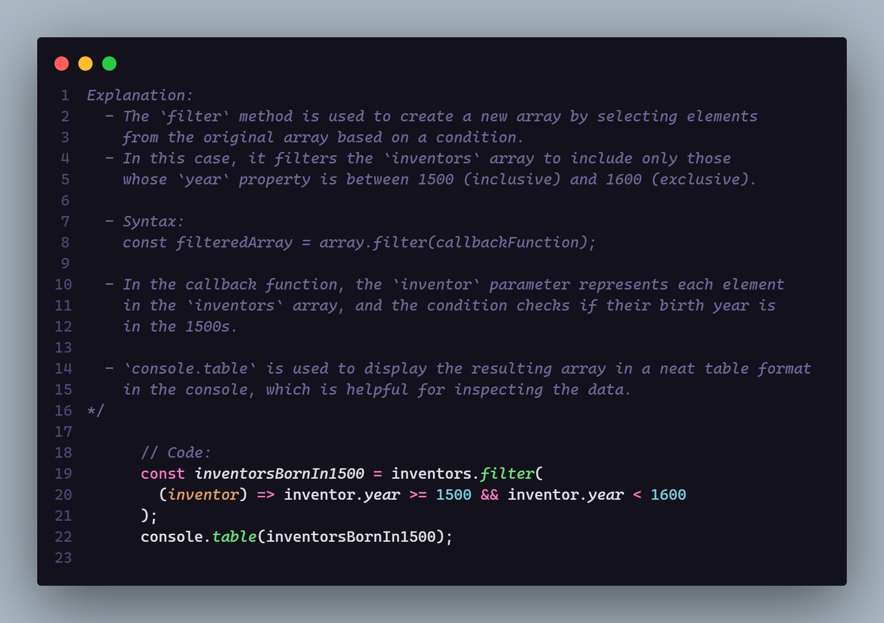

# JS30-4-ArrayCardio

# Array Cardio 💪

This project is part of the [30 Days of JavaScript](https://javascript30.com/) challenge by Wes Bos. It focuses on using various array methods to manipulate and analyze data about inventors and other items.

## Overview

In this exercise, we perform several operations on arrays, including filtering, mapping, sorting, and reducing. The operations are applied to two datasets: a list of inventors and a list of people.

## Features

- **Filter inventors born in the 1500s**: Using the `filter` method to create a new array of inventors who were born between 1500 and 1600.
- **Map inventors' full names**: Using the `map` method to generate an array of full names (first and last) of the inventors.
- **Sort inventors by birthdate**: Using the `sort` method to arrange inventors from oldest to youngest based on their birth years.
- **Calculate total years lived by all inventors**: Using the `reduce` method to sum up the years each inventor lived.
- **Sort inventors by years lived**: Sorting the inventors based on how many years they lived, from longest to shortest.
- **Extract and filter street names from Wikipedia**: Using DOM manipulation to select and filter street names that contain "de".
- **Sort people alphabetically by last name**: Sorting a list of people based on their last names.
- **Count instances of items in an array**: Using the `reduce` method to tally the occurrences of different vehicle types.

## Usage

1. **Clone the repository**:
   ```bash
   git clone <repository-url>
   cd <repository-folder>
   ```
2. **Open index.html in your browser to see the results in the JavaScript console.**

3. **Check the JavaScript console for output and results of the various array operations.**

**- Technologies Used -**
-- HTML
-- JavaScript

## Learning notes

Each of the array methods used in the code have comprehensive notes to help you understand how they work and to help me remember how they work.

Please see the example below --


